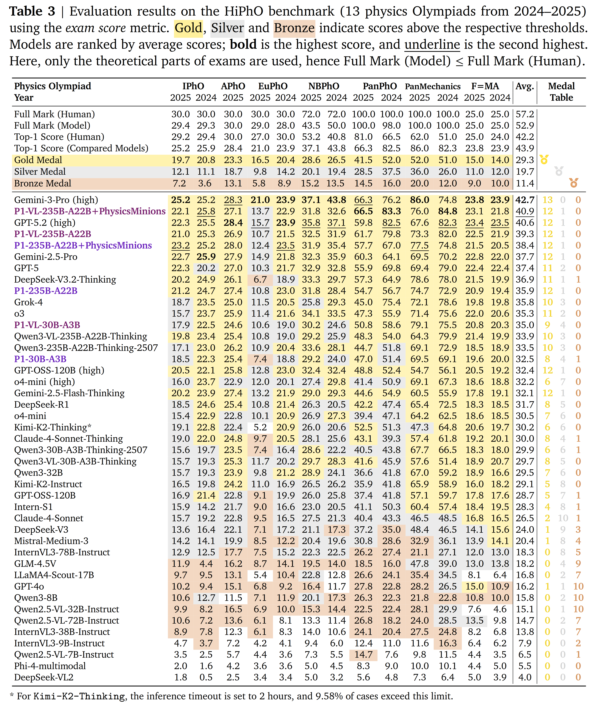
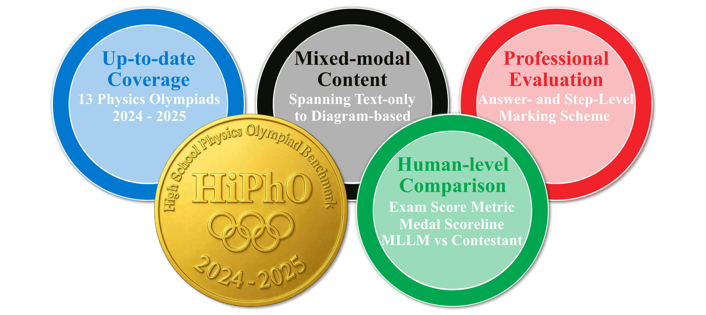

# P1-VL: Bridging Visual Perception and Scientific Reasoning in Physics Olympiads

<!-- [](https://arxiv.org/abs/2511.13612) -->
[](https://prime-rl.github.io/P1-VL/)
[](https://huggingface.co/PRIME-RL/P1-VL-30B-A3B)
[](https://huggingface.co/PRIME-RL/P1-VL-235B-A22B)
[](https://phyarena.github.io/)

<p align="center">
  
</p>


## Overview

Physics demands a rigorous synthesis of abstract laws and causal logic to model the behavior of the universe. Consequently, the ability to solve complex physics problems serves as a critical benchmark, distinguishing models that merely retrieve information from those capable of genuine, first-principles reasoning. Olympiad-level competitions, such as the International Physics Olympiad (IPhO) serve as a significant surrogate to evaluate the physics reasoning capacity of language models, where problems demand deep conceptual understanding and precise system decomposition.

**P1-VL** is a family of open-source vision-language models engineered for advanced scientific reasoning. Our methodology harmonizes Curriculum Reinforcement Learning—which employs progressive difficulty expansion to stabilize post-training—with Agentic Augmentation, enabling iterative self-verification at inference. Evaluated on HiPhO, a rigorous benchmark of 13 exams from 2024–2025, our flagship P1-VL-235B-A22B becomes the first open-source Vision-Language Model (VLM) to secure 12 gold medals, ranking No.3 in the model leaderboard, effectively solving tasks that require precise diagram-to-logic alignment. Notably, the standalone P1-VL outperforms previous agent-enhanced text baselines, while our agent-augmented system achieves the No. 2 overall rank globally, trailing only Gemini-3-Pro.


- **[P1-VL-30B-A3B](https://huggingface.co/PRIME-RL/P1-VL-30B-A3B)**: A 30B parameter model that surpasses larger closed-source models, demonstrating exceptional efficiency
- **[P1-VL-235B-A22B](https://huggingface.co/PRIME-RL/P1-VL-235B-A22B)**: A 235B parameter model achieving gold medal performance on IPhO 2025, rivaling top closed-source models 

---

## Results

P1-VL models demonstrate **top-tier physics reasoning** across all HiPhO contests.


<p align="center">
  
</p>

---

### FrontierScience-Olympiad Benchmark
P1-VL models achieve significant gains over their base counterparts across all three scientific domains, yielding a total score improvement of 8.0 and 9.1 points. Remarkably, even on this predominantly text-based benchmark, the multimodal P1-VL-235B-A22B outperforms its text-only sibling (P1-235B-A22B) by a margin of 2.3 points. Furthermore, when augmented with the PhysicsMinions agent framework, P1-VL-235B-A22B+PhysicsMinions attains a total score of 67.1, securing state-of-the-art performance among all evaluated open-source models.

| Model | Biology/10 | Chemistry/40 | Physics/50 | Total/100 |
|-------|------------|--------------|------------|-----------|
| GPT-5.2 | 43.5 | 89.0 | 74.3 | 77.1 |
| Gemini-3-Pro | 41.0 | 85.6 | 75.5 | 76.1 |
| Claude-Opus-4.5 | 24.0 | 81.8 | 72.5 | 71.4 |
| GPT-5.1 | 33.5 | 82.4 | 67.4 | 70.0 |
| GPT-5 | 35.5 | 81.5 | 67.0 | 69.7 |
| **P1-VL-235B-A22B+PhysicsMinions** | 26.3 | 77.2 | 67.3 | 67.1 |
| Grok-4 | 33.0 | 73.2 | 67.2 | 66.2 |
| DeepSeek-V3.2-Reasoner | 26.3 | 74.1 | 67.3 | 65.9 |
| P1-235B-A22B+PhysicsMinions | 30.0 | 71.0 | 68.0 | 65.4 |
| Kimi-K2-Thinking | 20.0 | 76.6 | 65.0 | 65.1 |
| GLM-4.7 | 20.0 | 70.6 | 69.5 | 65.0 |
| **P1-VL-235B-A22B** | 30.0 | 71.3 | 65.5 | 64.3 |
| o3 | 30.0 | 76.1 | 59.0 | 62.9 |
| P1-235B-A22B | 22.5 | 67.2 | 65.8 | 62.0 |
| o4-mini | 41.5 | 71.5 | 57.8 | 61.7 |
| GPT-OSS-120B (high) | 38.8 | 63.4 | 61.5 | 60.0 |
| Qwen3-VL-235B-A22B-Thinking | 26.3 | 61.9 | 57.8 | 56.3 |
| Qwen3-235B-A22B-Thinking-2507 | 26.3 | 58.1 | 57.3 | 54.5 |
| P1-30B-A3B | 15.0 | 61.9 | 56.3 | 54.4 |
| **P1-VL-30B-A3B** | 20.0 | 58.8 | 54.0 | 52.5 |
| Qwen3-VL-30B-A3B-Thinking	|18.8 |	49.4 |	43.5 |	43.4 |
| Qwen3-30B-A3B-Thinking-2507 | 10.0 | 47.8 | 45.3 | 42.8 |
| OpenAI o1 | 20.0 | 50.9 | 40.3 | 42.5 |
| GPT-4o | 3.0 | 12.4 | 14.1 | 12.3 |

<!-- *Evaluation results on the FrontierScience-Olympiad benchmark. The state-of-the-art performance of all the models is marked in bold, and that of open-source models is underlined.* -->


#### STEM Benchmarks
Below summarizes the comparative results, illustrating that our models consistently surpass their base counterparts across both text-only and multi-modal benchmarks.
| Benchmark | P1-VL-235B-A22B | Qwen3-VL-235B-A22B-Thinking | P1-VL-30B-A3B | Qwen3-VL-30B-A3B-Thinking |
| :--- | :--- | :--- | :--- | :--- |
| AIME24 | 93.8 | 93.3 | 90.4 | 90.0 |
| AIME25 | 92.1 | 90.8 | 87.9 | 83.7 |
| HMMT-Feb | 83.3 | 72.9 | 73.3 | 70.0 |
| HMMT-Nov | 88.3 | 84.2 | 85.4 | 80.8 |
| IMO-Answerbench | 70.6 | 62.3 | 65.3 | 60.3 |
| AMOBench | 47.5 | 39.0 | 44.5 | 37.0 |
| BeyondAIME | 70.6 | 68.5 | 65.9 | 63.8 |
| Brumo | 93.3 | 90.0 | 89.2 | 83.8 |
| CMICC | 83.1 | 81.6 | 79.1 | 73.4 |
| GPQA | 81.4 | 77.1 | 76.5 | 73.1 |
| LiveBench | 79.9 | 79.4 | 72.7 | 71.3 |
| HLE | 15.9 | 13.9 | 13.4 | 12.3 |
| MMMU | 78.0 | 77.2 | 73.6 | 74.8 |
| MMMU-Pro | 70.2 | 69.7 | 63.4 | 62.3 |
| EMMA-Mini | 71.3 | 69.6 | 64.8 | 61.4 |
| MathVista-Mini | 83.9 | 82.6 | 79.4 | 79.2 |

## 🧮 HiPhO Benchmark

[**HiPhO (High School Physics Olympiad)**](https://arxiv.org/abs/2509.07894) is the first benchmark focused on recent Physics Olympiads from 2024-2025 with **human-aligned evaluation**.

<div align="center">
  
</div>

### ✨ Key Features

- **Up-to-date Coverage**: Includes 13 Olympiad exam papers from 2024–2025 across international and regional competitions.
- **Mixed-modal Content**: Supports four modality types, spanning from text-only to diagram-based problems.
- **Professional Evaluation**: Uses official marking schemes for answer-level and step-level grading.
- **Human-level Comparison**: Maps model scores to medal levels (Gold/Silver/Bronze) and compares with human performance.

---

## Coevolutionary Multimodal Multi-Agent System: PhysicsMinions

To overcome the limitations of single-model inference, **P1-VL** is augmented with [**PhysicsMinions**](https://arxiv.org/abs/2509.24855), a coevolutionary multimodal multi-agent system that enhances test-time reasoning through structured perception, dual-stage verification, and iterative refinement.


| Module | Role |
| --- | --- |
| **Visual Studio** | Performs structured visual perception by observing, validating, and refining diagrams or plots into symbolic representations (optional when no visual input is present). |
| **Logic Studio** | Generates an initial solution and iteratively improves it via self-reflection and targeted revision. |
| **Review Studio** | Performs **dual-stage verification** with two dedicated verifiers: a Domain-Verifier (e.g., Physics-Verifier) that checks scientific consistency, and a General-Verifier that validates logical coherence, derivations, and numerical correctness. |

Beyond physics Olympiad tasks, PhysicsMinions naturally extends to **broader scientific scenarios**. By dynamically selecting domain-specific verifiers and solver prompts, the agentic framework supports heterogeneous problems in physics, chemistry, and biology while maintaining a unified coevolutionary structure.

---


## Acknowledgements

We are grateful to the open-source community for their invaluable contributions. Special thanks to:

- **[Qwen3-VL](https://huggingface.co/collections/Qwen/qwen3-vl)** - for providing the foundational base models that powered our research
- **[verl](https://github.com/volcengine/verl)** - for the versatile reinforcement learning framework that enabled our training pipeline
- **[vLLM](https://github.com/vllm-project/vllm)** - for the efficient LLM serving and inference infrastructure
- **[Megatron-LM](https://github.com/NVIDIA/Megatron-LM)** - for the large-scale model training framework

We also thank colleagues and collaborators who supported the development of P1 models, the accompanying datasets and visual assets.


## 🧾 Citation

If you find this work useful, please cite:

```bibtex
@misc{p1vl2025,
  title={P1-VL: Bridging Visual Perception and Scientific Reasoning in Physics Olympiads},
  author={P1 Team},
  year={2025},
  url={https://prime-rl.github.io/P1-VL/}
}
